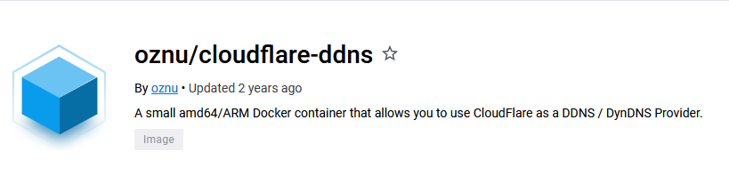

# What is Cloudlfare DDNS and why do I need it?

## First things first, how is my domain set up? 

First of all , my domain alepismyname.dev was bought on Google Domains and I had it's DNS server's changed to Cloudflare's own dns servers so my DNS configurations could be done over at Cloudflare

[insert picture here]

## The main issue

Now my domain and cloudflare are all fine and dandy but I have an issue with pointing my public IP to my domain name. This is because my ISP (Maxis) in Malaysia doesn't provide home users with a fixed public IP and I sure can't afford to pay extra for a fixed business IP. 

This means that I'm stuck with a dynamic IP, this sucks when you're hosting public services like a VPN server or a dedicated game server like Minecraft. 

## What's the fix then? 

Well the fix would be to just subscribe to a DDNS service like duckdns or no-ip and just add a CNAME record in Cloudflare to just point it there. 

Well I don't feel like doing that, I wanted a way to do it directly through Cloudflare and I found out that you could with a simple docker container! Namely cloudflare-ddns by oznu , granted it hasn't been updated for 2 years. Take that as you will. 

